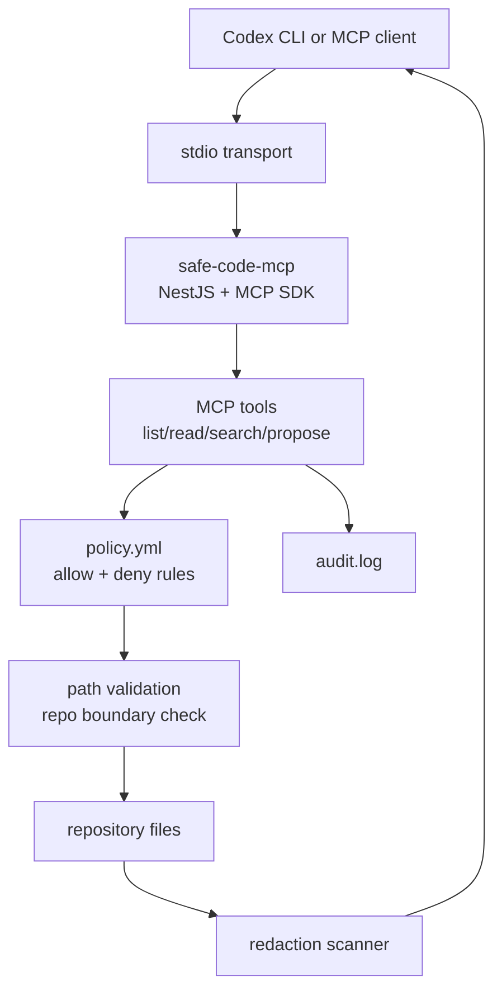
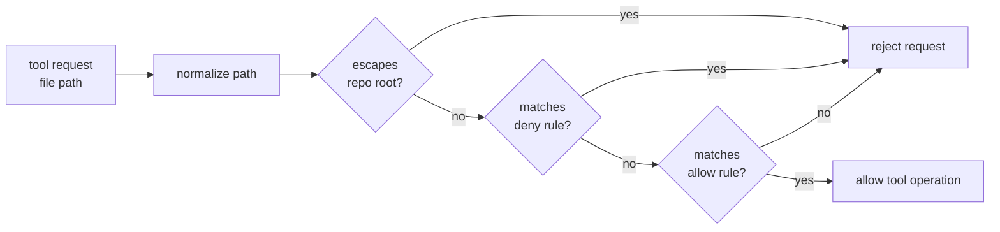

# safe-code-mcp

`safe-code-mcp` is a local Model Context Protocol (MCP) server that gives Codex or another MCP client controlled access to a repository. It exposes a small set of repository tools, checks every requested path against `policy.yml`, redacts obvious secrets from returned content, and writes an audit event for each tool call.

The goal is not to make the MCP protocol itself complicated. The goal is to create a narrow, reviewable access layer between an AI coding agent and project files.

## Architecture



## Available Tools

| Tool | Purpose | Inputs |
| --- | --- | --- |
| `list_allowed_files` | Lists files visible under the configured policy. | none |
| `read_file` | Reads a bounded line range from an allowed file and redacts obvious secrets. | `filePath`, `startLine`, `endLine` |
| `search_code` | Searches allowed files for a literal query and redacts matching lines. | `query` |
| `propose_patch` | Accepts a patch proposal, scans it for secrets, and returns it for manual review. | `filePath`, `diff` |

`read_file` requires `startLine >= 1` and `endLine >= 1`. The server also caps reads using `maxReadLines` from `policy.yml`.

## Policy Model

Access is controlled by `policy.yml`.



The current policy allows common source, test, documentation, and project metadata paths, including:

- `src/**`
- `tests/**`, `test/**`, `__tests__/**`
- `docs/**`, `adr/**`, `openapi/**`, `api/**`
- `package.json`, `package-lock.json`, `tsconfig*.json`, `nest-cli.json`, `README.md`
- deployment templates such as `docker-compose*.yml`, `k8s/**`, `helm/**`, and selected Terraform templates

The current policy denies sensitive or noisy paths, including:

- `.env*` and nested environment files
- private keys, certificates, keystores, GPG files, and credential paths
- `.git/**`, `node_modules/**`, `dist/**`, build output, caches, and coverage
- logs, audit evidence, database dumps, backups, exports, spreadsheets, SQL files, and data files
- production configuration paths
- customer, card, payment, and regulated sample data directories

If a file matches both allow and deny rules, the deny rule wins.

## Redaction

Returned content is passed through a lightweight redaction scanner. It currently detects common patterns such as:

- OpenAI-style `sk-...` tokens
- AWS access key IDs
- private key blocks
- common database connection URLs
- bearer tokens
- assignments containing names like `api_key`, `secret`, `token`, or `password`

This redaction layer is a safety net, not a replacement for the policy. Sensitive paths should still be denied in `policy.yml`.

## Audit Log

Every tool call writes an append-only JSON event to the configured audit log:

```yaml
auditLog: "./audit.log"
```

The audit events include details such as the tool name, file path, line range, search match counts, and redaction counts. Treat this file as operational evidence. The default policy denies `*.log` files, so the MCP tools should not expose `audit.log`.

## Run Locally

Install dependencies:

```bash
npm install
```

Build the project:

```bash
npm run build
```

Run the compiled stdio MCP server:

```bash
node dist/server.js
```

For development, run the TypeScript entrypoint through `tsx`:

```bash
npx tsx src/server.ts
```

## Inspect The Server

Use the MCP Inspector to test the local server:

```bash
npx @modelcontextprotocol/inspector node dist/server.js
```

## Codex Configuration

Add a server entry like this to `~/.codex/config.toml`:

```toml
[mcp.servers.safe-code]
command = "npx"
args = ["tsx", "src/server.ts"]
cwd = "/Volumes/Projects/ERP-Hub Inc/storeVein/erp-mcp-starter"
```

After restarting Codex, the MCP client should be able to call the `safe-code-mcp` tools.

## Example Tool Calls

List files visible through the policy:

```json
{
  "name": "list_allowed_files",
  "arguments": {}
}
```

Read the first 25 lines of a source file:

```json
{
  "name": "read_file",
  "arguments": {
    "filePath": "src/main.ts",
    "startLine": 1,
    "endLine": 25
  }
}
```

Search allowed files:

```json
{
  "name": "search_code",
  "arguments": {
    "query": "McpService"
  }
}
```

Submit a patch proposal for review:

```json
{
  "name": "propose_patch",
  "arguments": {
    "filePath": "src/main.ts",
    "diff": "--- a/src/main.ts\n+++ b/src/main.ts\n..."
  }
}
```

## Security Notes

This project is useful as a policy gate, but it is not a complete security boundary by itself.

For stronger protection:

- Run the AI agent in a sandbox where the real repository is not directly mounted.
- Give the agent access only to this MCP server.
- Keep `.env`, keys, production config, database dumps, logs, exports, and regulated sample data denied.
- Prefer read-only tools unless write access is explicitly needed.
- Review `audit.log` regularly.
- Use dedicated secret scanners such as Gitleaks or TruffleHog in CI.

The hardest part is preventing bypasses. If the agent can read the repository directly through the filesystem, it can bypass MCP policy. For real enforcement, the MCP server should be the only process with direct access to protected files.

## Project Structure

```text
src/
  audit.ts          append-only audit logging
  main.ts           Nest application bootstrap
  mcp.service.ts    MCP server and tool registration
  policy.ts         policy loading and path checks
  redact.ts         secret redaction patterns
  server.ts         stdio server entrypoint
  stderr-logger.ts  logger that avoids stdout protocol noise
policy.yml          repository allow/deny policy
audit.log           local audit output
```

## Roadmap Ideas

- Add `apply_patch_after_scan` with stronger validation and explicit approval.
- Add semantic code search over allowed files.
- Add policy tests for allow/deny edge cases.
- Add external secret scanning before returning or applying patches.
- Add per-project policy profiles.
- Add structured audit rotation and retention.
